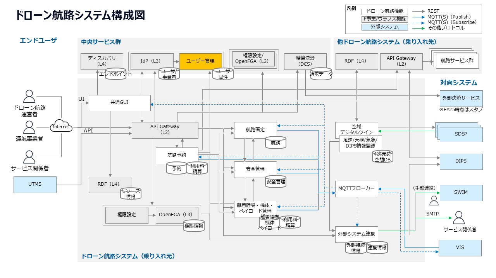

## 概要  
本手順では、ユーザ管理サービスの動作確認を可能とするDockerコンテナの構築手順を説明する。  



## 手順概要
### 1. 事前準備
本リポジトリを動作させるために必要なDBおよびL3-identity-component、OpenFGAの準備を行う。

### 2. DB構築
DDL、DMLを実行し、データベース環境を構築する。

### 3. Docker構築
本リポジトリ（drone-user-attribute）をDockerコンテナとして起動する。

### 4. 動作確認
動作確認を実施する。

## 手順詳細

### 1. 事前準備

#### 1.1 実行環境準備
本リポジトリのコンテナを構築するために必須となるソフトウェアを事前にインストールする。  
必要なソフトウェアおよび、動作確認済み実行環境は以下のとおりである。

| 名称 | バージョン | 備考 |
| --- | --- | --- |
| JDK(Amazon Corretto) | 21 |  |
| Docker | 25.0.5 |  |
| Maven | 3.9.8 |  |


#### 1.2 DB構築準備
DBを構築するために必要なソフトウェアを事前にインストールする。  
本手順で動作確認に使用するソフトウェアは以下のとおりである。

| 名称 | バージョン | 備考 |
| --- | --- | --- |
| PostgresSQL | 17.6 |  |

また、本リポジトリの「variables.env」に以下の環境変数を設定する。  
| 環境変数名 | 説明 | 備考 |
| --- | --- | --- |
| DB_HOSTNAME | データベースのホスト名 |  |
| DB_PORT | データベースのポート番号 |  |
| DB_NAME | データベース名 |  |
| DB_USERNAME | データベースのユーザ名 |  |
| DB_PASSWORD | データベースのパスワード |  |


#### 1.3 L3-identity-component API利用準備
本リポジトリの「variables.env」に以下の環境変数を設定する。
| 環境変数名 | 説明 | 備考 |
| --- | --- | --- |
| API_KEY | L3-identity-component接続用のAPI-Key | 事前払い出しが必要 |
| IDP_POST_ENDPOINT | L3-identity-componentの"事業者情報登録API"のエンドポイント |  |
| IDP_GET_ENDPOINT | L3-identity-componentの"事業者情報取得API"のエンドポイント |  |
| IDP_PUT_ENDPOINT | L3-identity-componentの"事業者情報ステータス更新API"のエンドポイント |  |
| FGA_ENDPOINT | OpenFGAの"認可判定API"のエンドポイント |  |
| FGA_STORE_ID | OpenFGAで認可判定に利用するストアID | 事前払い出しが必要 |
| FGA_RESOURCE_ID | OpenFGAで認可判定を行う対象リソース | 「drone_user_attribute」を設定してください |


#### 1.4 L3-identity-component 事前準備
L3-identity-componentにクライアントシステム認証用アカウント(以降、アカウント)および認可コードフロー用アカウントを登録する。
- アクセストークン取得に必要となる以下情報を取得済みであること
  - アクセストークン取得用APIキー
  - アクセストークン取得用クライアントID
  - アクセストークン取得用クライアントシークレット
- L3-identity-componentへのクライアントID登録方法、アクセストークン取得方法は以下リポジトリを参照
  - open-dataspaces/L3-identity-component
- 認可コードフローのログインには、ユーザ管理サービスの以下APIで登録した事業者/ユーザ(以降、ログインユーザ)の情報を利用すること。
  - 事業者登録API
  - ユーザ登録API(スーパーユーザ)
  - ユーザ登録API

#### 1.5 OpenFGA 事前準備
OpenFGAに認可判定用の認可モデル登録と作成したアカウント、ログインユーザが利用する機能のアクセス許可(認可タプル登録)を行う。
（ユーザ管理では登録したアカウントとログインユーザに対して、OpenFGAを用いて機能ごとにアクセス制御(=認可判定)を行うため。）
- 認可モデル&認可タプル登録に必要となる以下情報を取得済みであること
  - ユーザ管理用ストアID
- OpenFGAにユーザ管理用の認可モデルを登録する。
  - 登録する認可モデルはdrone-user-attribute/docs/model/user-management_model.fgaを参照
  - 認可モデル登録コマンド例はdrone-user-attribute/docs/model/user-management_model_登録・取得コマンド例.txtの ■認可モデル登録APIコマンド 参照
  - 登録した認可モデル取得コマンド例はdrone-user-attribute/docs/model/user-management_model_登録・取得コマンド例.txtの ■認可モデル取得APIコマンド 参照
- OpenFGAにユーザ管理サービスの機能毎のアクセス許可設定（認可タプル登録）を行う。
  - アクセス許可設定はdrone-user-attribute/docs/tuple/user-management_tuple_登録コマンド例.txtの ■機能毎のアクセス許可設定 参照
- OpenFGAに各アカウント、各ログインユーザの利用する機能のアクセス許可（認可タプル登録）を行う。
  - 利用する機能ごとの登録認可タプルのコマンド例はdrone-user-attribute/docs/tuple/user-management_tuple_登録コマンド例.txtの以下を参照
    - 参照機能：■参照機能アクセス許可コマンド 参照
    - 登録/更新/削除機能：■登録/更新/削除機能アクセス許可コマンド 参照
  - アクセス許可はアカウント、ログインユーザが追加される度に実施が必要となる。
- 認可モデル&認可タプルの登録方法等は以下OpenFGAのドキュメントを参照
  - https://openfga.dev/api/service
    - 認可モデル登録：Authorization Models > POST /stores/{store_id}/authorization-models
    - 認可タプル登録：Relationship Tuples > POST /stores/{store_id}/write


### 2. DB構築

#### 2.1 DDLの投入
本リポジトリの「drone-user-attribute/docs/sql/ddl」ディレクトリ以下のDDLを、DBに投入する。


### 3. Docker構築  

以下の流れでDockerコンテナの作成、起動を行う。  
- Dockerコンテナ起動時に必要な環境変数ファイル（variables.env）を作成する  
- jarファイルをビルドし、Dockerコンテナイメージを作成する  
- Dockerコンテナイメージを用いてDockerコンテナを作成する（コンテナ作成時に環境変数ファイルをパラメータとして渡し、コンテナ内の環境変数を設定する）  

※本手順では、実行ユーザがdockerグループに所属している前提でコマンドを記載しています。
実行ユーザがdockerグループに所属していない場合、dockerコマンドに「sudo」を付与し、sudoが可能なユーザで実行する必要があります。

#### 3.1 環境変数の設定

#### ①本リポジトリの「variables.env」に、「1.2 DB構築準備」「1.3 L3-identity-component API利用準備」で準備した環境変数が漏れなく設定されていることを確認する。  

#### ②試験環境に合わせて以下の環境変数を設定する。
| 環境変数名 | 説明 | 備考 |
| --- | --- | --- |
| APPENV | 環境差分のあるプロパティファイルの読み込み設定。<br>「`prod`」を設定する。 |  |


#### 3.2 Dockerコンテナイメージ作成

#### ①ビルド用資材の配置
ビルドに必要なリポジトリ資材を配置する。  
本手順では、ホームディレクトリ配下に以下のパスで資材を配置している想定で手順を作成している。  
- 共通部品リポジトリ（drone-com）の格納先  
```bash
~/work/drone-com
```
- 本リポジトリ（drone-user-attribute）の格納先  
```bash
~/work/drone-user-attribute
```
  
#### ②drone-comのビルド
```bash
cd ~/work/drone-com
mvn clean install -Dmaven.test.skip
```

#### ③drone-user-attributeのビルド
```bash
cd ~/work/drone-user-attribute
mvn clean package -Dmaven.test.skip
```

#### ④Dorkerイメージ作成用資材の配置
- ビルドした資材を配置  
```bash
cd ~/work/drone-user-attribute
mkdir -p bin
cp -a drone-user-attribute-main/target/*.jar bin/
cp docker-entrypoint.sh ./bin/
```

#### ⑤Dockerイメージの作成
```bash
docker build -t drone-user-attribute-image .
```

#### ⑥Dockerイメージの確認
```bash
docker images
```

#### 3.3 Dockerコンテナ作成

#### ①Dockerコンテナ作成
```bash
docker run -d -p 8080:8080 --name "drone-user-attribute" --env-file variables.env drone-user-attribute-image:latest /bin/bash
```

#### ②Dockerコンテナの起動確認
```bash
docker ps -a  
```
以下のように、STATUSが「Up」となっていることを確認する。
```bash
CONTAINER ID   IMAGE                                   COMMAND                  CREATED         STATUS         PORTS     NAMES
d88ba81cdabd   drone-user-attribute-image:v1.0   "./docker-entrypoint…"   8 minutes ago   Up 8 minutes             drone-user-attribute
```

### 4. 動作確認

#### 4.1 登録API動作確認

#### 4.1.1 事業者登録API動作確認

前提：
- `SWIM連携用事業者ID(3桁)`に対応するIDを取得済みであること。
- `アクセストークン`を取得するのに利用した`アカウント`または`ログインユーザ`について、`登録/更新/削除機能`および`参照機能`の認可タプルが登録されていること。

#### ①事業者登録APIの実行

以下のcurlを実行し、事業者登録が成功(201レスポンス返却)することを確認する。
```
curl -X POST -H "Authorization: bearer {取得したアクセストークン}" -H "Content-Type: application/json" \
-d '{
    "login_user_id": "{登録するログインユーザID(≒メールアドレス)}",
    "operator_name": "{登録するユーザ名}",
    "attribute": {
        "roleIds": ["{ロールID ※リスト指定可能}"],
        "dipsAccountId": "{DIPSアカウントID}",
        "dipsAccountName": "{DIPSアカウント名}",
        "phone": "{電話番号}",
        "swimOperatorId": "{SWIM連携用事業者ID(3桁)}"
    }
}' \
http://{ユーザ管理コンテナのドメイン}/user/api/v1/operator
```
#### ②ユーザ属性取得APIの実行

以下のcurlを実行し、登録した事業者の属性情報が取得できることを確認する。
```
curl -X POST -H "Authorization: bearer {取得したアクセストークン}" -H "Content-Type: application/json" \
-d '{
    "loginIdList": ["{登録したログインユーザID(≒メールアドレス)}"]
}' \
http://{ユーザ管理コンテナのドメイン}/user/api/v1/user_attr
```

#### 4.1.2 ユーザ登録API(スーパーユーザ)動作確認

前提：
- `所属事業者`が事業者登録APIで事前に登録されていること。
- `アクセストークン`を取得するのに利用した`アカウント`または`ログインユーザ`について、`登録/更新/削除機能`および`参照機能`の認可タプルが登録されていること。

#### ①ユーザ登録API(スーパーユーザ)の実行

以下のcurlを実行し、ユーザ登録が成功(201レスポンス返却)することを確認する。
```
curl -X POST -H "Authorization: bearer {取得したアクセストークン}" -H "Content-Type: application/json" \
-d '{
    "login_user_id": "{登録するログインユーザID(≒メールアドレス)}",
    "operator_name": "{登録するユーザ名}",
    "attribute": {
        "operatorId": "{所属事業者ID}",
        "roleIds": ["{ロールID ※リスト指定可能}"]
    }
}' \
http://{ユーザ管理コンテナのドメイン}/user/api/v1/admin/user_info
```
#### ②ユーザ属性取得APIの実行

以下のcurlを実行し、登録したユーザの属性情報が取得できることを確認する。
```
curl -X POST -H "Authorization: bearer {取得したアクセストークン}" -H "Content-Type: application/json" \
-d '{
    "loginIdList": ["{登録したログインユーザID(≒メールアドレス)}"]
}' \
http://{ユーザ管理コンテナのドメイン}/user/api/v1/user_attr
```

#### 4.1.3 ユーザ登録API動作確認

前提：
- `操作ユーザ`がユーザ登録API(スーパーユーザ)またはユーザ登録APIで事前にユーザ登録されていること。
- `アクセストークン`を取得するのに利用した`アカウント`または`ログインユーザ`について、`登録/更新/削除機能`および`参照機能`の認可タプルが登録されていること。

#### ①ユーザ登録APIの実行

以下のcurlを実行し、ユーザ登録が成功(201レスポンス返却)することを確認する。
```
curl -X POST -H "Authorization: operatorUid {操作ユーザのuser_id(UUID)}, bearer {取得したアクセストークン}" -H "Content-Type: application/json" \
-d '{
    "login_user_id": "{登録するログインユーザID(≒メールアドレス)}",
    "operator_name": "{登録するユーザ名}",
    "attribute": {
        "roleIds": ["{ロールID ※リスト指定可能}"]
    }
}' \
http://{ユーザ管理コンテナのドメイン}/user/api/v1/user_info
```
#### ②ユーザ属性取得APIの実行

以下のcurlを実行し、登録したユーザの属性情報が取得できることを確認する。
```
curl -X POST -H "Authorization: bearer {取得したアクセストークン}" -H "Content-Type: application/json" \
-d '{
    "loginIdList": ["{登録したログインユーザID(≒メールアドレス)}"]
}' \
http://{ユーザ管理コンテナのドメイン}/user/api/v1/user_attr
```


#### 4.2 属性更新API動作確認

#### 4.2.1 事業者属性更新API動作確認

前提：
- swimOperatorIdを更新する場合：`SWIM連携用事業者ID(3桁)`に対応するIDを取得済みであること。
- `アクセストークン`を取得するのに利用した`アカウント`または`ログインユーザ`について、`登録/更新/削除機能`および`参照機能`の認可タプルが登録されていること。

#### ①事業者属性更新APIの実行

以下のcurlを実行し、事業者更新が成功(200レスポンス返却)すること、更新後の内容がレスポンスとして返却されていることを確認する。
```
curl -X PUT -H "Authorization: bearer {取得したアクセストークン}" -H "Content-Type: application/json" \
-d '{
    "login_user_id": "{更新後のログインユーザID(≒メールアドレス)}",
    "operator_name": "{更新後のユーザ名}",
    "attribute": {
        "roleIds": ["{更新後のロールID ※リスト指定可能}"],
        "dipsAccountId": "{更新後のDIPSアカウントID}",
        "dipsAccountName": "{更新後のDIPSアカウント名}",
        "phone": "{更新後の電話番号}",
        "swimOperatorId": "{更新後のSWIM連携用事業者ID(3桁)}"
    }
}' \
http://{ユーザ管理コンテナのドメイン}/user/api/v1/operator_attr?operator_id={更新対象の事業者のoperator_id(UUID)}
```
#### ②ユーザ属性取得APIの実行

以下のcurlを実行し、更新した事業者の属性情報が更新後の内容になっていることを確認する。
```
curl -X POST -H "Authorization: bearer {取得したアクセストークン}" -H "Content-Type: application/json" \
-d '{
    "loginIdList": ["{更新対象の事業者のログインユーザID(≒メールアドレス)}"]
}' \
http://{ユーザ管理コンテナのドメイン}/user/api/v1/user_attr
```

#### 4.2.2 ユーザ属性更新API(スーパーユーザ)動作確認

前提：
- `所属事業者`が事業者登録APIで事前に登録されていること。
- `アクセストークン`を取得するのに利用した`アカウント`または`ログインユーザ`について、`登録/更新/削除機能`および`参照機能`の認可タプルが登録されていること。

#### ①ユーザ属性更新API(スーパーユーザ)の実行

以下のcurlを実行し、ユーザ属性更新が成功(200レスポンス返却)すること、更新後の内容がレスポンスとして返却されていることを確認する。
```
curl -X PUT -H "Authorization: bearer {取得したアクセストークン}" -H "Content-Type: application/json" \
-d '{
    "login_user_id": "{更新後のログインユーザID(≒メールアドレス)}",
    "operator_name": "{更新後のユーザ名}",
    "attribute": {
        "operatorId": "{更新後の所属事業者ID}",
        "roleIds": ["{更新後のロールID ※リスト指定可能}"]
    }
}' \
http://{ユーザ管理コンテナのドメイン}/user/api/v1/admin/user_attr?user_id={更新対象のユーザのuser_id(UUID)}
```
#### ②ユーザ属性取得APIの実行

以下のcurlを実行し、更新したユーザの属性情報が更新後の内容になっていることを確認する。
```
curl -X POST -H "Authorization: bearer {取得したアクセストークン}" -H "Content-Type: application/json" \
-d '{
    "loginIdList": ["{更新対象のユーザのログインユーザID(≒メールアドレス)}"]
}' \
http://{ユーザ管理コンテナのドメイン}/user/api/v1/user_attr
```

#### 4.2.3 ユーザ属性更新API動作確認

前提：
- `操作ユーザ`がユーザ登録API(スーパーユーザ)またはユーザ登録APIで事前にユーザ登録されていること。
- `操作ユーザ`と`更新対象のユーザ`が同一の所属事業者であること。
- `アクセストークン`を取得するのに利用した`アカウント`または`ログインユーザ`について、`登録/更新/削除機能`および`参照機能`の認可タプルが登録されていること。

#### ①ユーザ属性更新APIの実行

以下のcurlを実行し、ユーザ属性更新が成功(200レスポンス返却)すること、更新後の内容がレスポンスとして返却されていることを確認する。
```
curl -X PUT -H "Authorization: operateUid {操作ユーザのuser_id(UUID)}, bearer {取得したアクセストークン}" -H "Content-Type: application/json" \
-d '{
    "login_user_id": "{更新後のログインユーザID(≒メールアドレス)}",
    "operator_name": "{更新後のユーザ名}",
    "attribute": {
        "roleIds": ["{更新後のロールID ※リスト指定可能}"]
    }
}' \
http://{ユーザ管理コンテナのドメイン}/user/api/v1/user_attr?user_id={更新対象のユーザのuser_id(UUID)}
```
#### ②ユーザ属性取得APIの実行

以下のcurlを実行し、更新したユーザの属性情報が更新後の内容になっていることを確認する。
```
curl -X POST -H "Authorization: bearer {取得したアクセストークン}" -H "Content-Type: application/json" \
-d '{
    "loginIdList": ["{更新対象のユーザのログインユーザID(≒メールアドレス)}"]
}' \
http://{ユーザ管理コンテナのドメイン}/user/api/v1/user_attr
```


#### 4.3 削除API動作確認

#### 4.3.1 事業者削除API動作確認

前提：
- `アクセストークン`を取得するのに利用した`アカウント`または`ログインユーザ`について、`登録/更新/削除機能`および`参照機能`の認可タプルが登録されていること。

#### ①事業者削除APIの実行

以下のcurlを実行し、事業者削除が成功(200レスポンス返却)することを確認する。
```
curl -X DELETE -H "Authorization: bearer {取得したアクセストークン}" \
http://{ユーザ管理コンテナのドメイン}/user/api/v1/operator?operator_id={削除対象の事業者のoperator_id(UUID)}
```
#### ②ユーザ属性取得APIの実行

以下のcurlを実行し、削除した事業者の属性情報が取得できないことを確認する。
```
curl -X POST -H "Authorization: bearer {取得したアクセストークン}" -H "Content-Type: application/json" \
-d '{
    "loginIdList": ["{削除対象の事業者のログインユーザID(≒メールアドレス)}"]
}' \
http://{ユーザ管理コンテナのドメイン}/user/api/v1/user_attr
```

#### 4.3.2 ユーザ削除API(スーパーユーザ)動作確認

前提：
- `アクセストークン`を取得するのに利用した`アカウント`または`ログインユーザ`について、`登録/更新/削除機能`および`参照機能`の認可タプルが登録されていること。

#### ①ユーザ削除API(スーパーユーザ)の実行

以下のcurlを実行し、ユーザ削除が成功(200レスポンス返却)することを確認する。
```
curl -X DELETE -H "Authorization: bearer {取得したアクセストークン}" \
http://{ユーザ管理コンテナのドメイン}/user/api/v1/admin/user_info?user_id={削除対象のユーザのuser_id(UUID)}
```
#### ②ユーザ属性取得APIの実行

以下のcurlを実行し、削除したユーザの属性情報が取得できないことを確認する。
```
curl -X POST -H "Authorization: bearer {取得したアクセストークン}" -H "Content-Type: application/json" \
-d '{
    "loginIdList": ["{削除対象のユーザのログインユーザID(≒メールアドレス)}"]
}' \
http://{ユーザ管理コンテナのドメイン}/user/api/v1/user_attr
```

#### 4.3.3 ユーザ削除API動作確認

前提：
- `操作ユーザ`がユーザ登録API(スーパーユーザ)またはユーザ登録APIで事前にユーザ登録されていること。
- `操作ユーザ`が削除対象のユーザとは別であること。
- `操作ユーザ`と`削除対象のユーザ`が同一の所属事業者であること。
- `アクセストークン`を取得するのに利用した`アカウント`または`ログインユーザ`について、`登録/更新/削除機能`および`参照機能`の認可タプルが登録されていること。

#### ①ユーザ削除APIの実行

以下のcurlを実行し、ユーザ削除が成功(200レスポンス返却)することを確認する。
```
curl -X DELETE -H "Authorization: operateUid {操作ユーザのuser_id(UUID)}, bearer {取得したアクセストークン}" \
http://{ユーザ管理コンテナのドメイン}/user/api/v1/user_info?user_id={削除対象のユーザのuser_id(UUID)}
```
#### ②ユーザ属性取得APIの実行

以下のcurlを実行し、削除したユーザの属性情報が取得できないことを確認する。
```
curl -X POST -H "Authorization: bearer {取得したアクセストークン}" -H "Content-Type: application/json" \
-d '{
    "loginIdList": ["{削除対象のユーザのログインユーザID(≒メールアドレス)}"]
}' \
http://{ユーザ管理コンテナのドメイン}/user/api/v1/user_attr